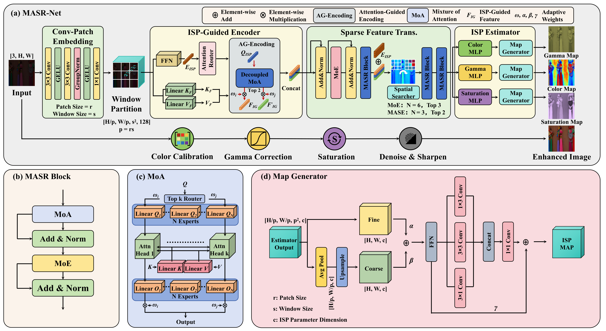

# MASR-Net: An Asymmetric Mixture-of-Attention based Sparse Restoration Network for Rectifying Visual Imbalance Defects

[](https://opensource.org/licenses/MIT)
[](https://www.python.org/downloads/release/python-380/)
[](https://pytorch.org/)

## 📋 Overview

MASR-Net (Asymmetric Mixture-of-Attention based Sparse Restoration Network) is a deep learning network designed to address visual imbalance defects in low-light image enhancement. Addressing the challenge that existing methods struggle to balance global consistency with local detail recovery, MASR-Net achieves breakthroughs through the following innovative designs:

1. **Region-Adaptive Processing**: Inspired by the sparse computation paradigm of Large Language Models (LLMs), the Mixture-of-Attention (MoA) mechanism is innovatively applied to low-level vision tasks. MoA's asymmetric architecture maintains global spatial consistency while focusing on local variations through shared Key-Value projections combined with sparse Query-Output expert selection.

2. **Physical Attribute Decoupling**: Proposes an ISP-Guided Encoder that implicitly decouples features into physics-based branches (Gamma, Color, Saturation) through attention routing, enabling dedicated experts to collaboratively handle spatially non-uniform degradation.

3. **Hierarchical MASR Module**: Constructs hierarchical MASR Blocks combining Mixture-of-Attention and Mixture-of-Experts, stacked in multiple layers to handle feature-level differences as well as spatial variations and correlations.

4. **Parameter Map Generation**: Map Generator generates pixel-level ISP parameter maps through dual-path fusion, eliminating checkerboard artifacts.



Extensive experiments on multiple benchmark datasets (LOL-v1/v2, LSRW) and underground mine datasets (CMUPD) demonstrate that MASR-Net achieves state-of-the-art performance with PSNR up to 28.71 dB and SSIM up to 0.860, while maintaining competitive efficiency (7.18G FLOPs).

## 🌟 Key Features

- **ISP Semantic-Content Decoupling Mechanism**: Innovative "guidance-content" decoupled encoding for deep integration of selection and processing
- **Separated MoE**: Creates dedicated information channels for different ISP methods, avoiding information confusion
- **Efficient Architecture**: Achieves excellent performance with only 6.58M parameters (PSNR=28.71, SSIM=0.860)
- **End-to-End Training**: Supports complete training and inference pipeline
- **Multi-Dataset Support**: Supports mainstream low-light enhancement datasets including LOL-v1, LOL-v2, LSRW, etc.

## 📊 Performance

| Dataset | PSNR | SSIM |
|--------|------|------|
| LOL-v1      | 26.79 dB | 0.861 |
| LOL-v2-real | 28.71 dB | 0.860 |
| LSRW-Huawei | 23.05 dB | 0.737 |
| LSRW-Nikon  | 19.99 dB | 0.600 |
| CMUPD       | 30.23 dB | 0.879 |

MASR-Net achieves state-of-the-art performance metrics while maintaining efficient computation (7.18G FLOPs).


## 🚀 Quick Start

### Requirements

**Hardware Requirements**:
- GPU: NVIDIA RTX 5090 (recommended) or other CUDA-capable GPUs
- VRAM: 16GB+ recommended

**Software Requirements**:
- Python: Python 3.9+
- CUDA: 12.8 (matching PyTorch version)

**Install Dependencies**:

Recommended installation using `requirements.txt`:
```bash
pip install -r requirements.txt
```

Or manually install core dependencies:
```bash
pip install torch==2.7.0+cu128 torchvision==0.22.0+cu128 torchaudio==2.7.0+cu128
pip install numpy matplotlib scikit-image tqdm pillow kornia optuna rich pandas
```

### Dataset Preparation

The project supports the following dataset structure:

```
datasets/
├── LOL_V1/
│   └── lol_dataset/
│       ├── Train/
│       ├── Test/
│       └── Val/
├── LOL_v2/
│   ├── Train/
│   ├── Test/
│   └── Val/
└── OpenDataLab___LSRW/
    └── raw/LSRW/
```

Download the datasets and place them in the corresponding directories.

### ⚙️ Important Configuration

**Key configuration parameters for different datasets:**

| Dataset | patch_size | win_size | Description |
|--------|------------|----------|------|
| LOL-v1 | 4          | 2        | Configuration for LOL-v1 dataset |
| LSRW   | 4          | 2        | Configuration for LSRW dataset   |
| LOL-v2 | 2          | 4        | Configuration for LOL-v2 dataset |

**Configuration Modification Method:**
1. Modify the corresponding parameters in `config.py`:
   ```python
   # For LOL-v1 and LSRW datasets
   'patch_size': 4,
   'win_size': 2,

   # For LOL-v2 dataset
   'patch_size': 2,
   'win_size': 4,
   ```

2. **If you need to change input/output image dimensions**, you must modify both:
   - `input_size` and `output_size` parameters in `config.py`
   - Corresponding image preprocessing size settings in `data_loader.py`

⚠️ **Note**: Different patch_size and win_size combinations affect the model's window partitioning and feature extraction strategy. Make sure to select the correct configuration for your dataset.

### Pretrained Models

Place pretrained weight files in the `checkpoints/` directory:
- `LOLv1_checkpoints.pth` - Model trained on LOL-v1 dataset
- `LOLv2_real_checkpoints.pth` - Model trained on LOL-v2-real dataset
- `LSRW_checkpoints.pth` - Model trained on LSRW dataset

## 📖 Usage

### Training

#### Basic Training
```bash
# Train on LOL-v2 dataset
python train.py --data_dir ./datasets/LOL_v2 --epochs 1200 --batch_size 4

# Custom parameter training
python train.py \
    --data_dir ./datasets/LOL_V1/lol_dataset \
    --epochs 800 \
    --batch_size 8 \
    --lr 1e-4 \
    --save_dir ./checkpoints
```


### Testing

#### Evaluate on Test Set
```bash
# Test with LOL-v1 model
python test.py \
    --data_dir ./datasets/LOL_V1/lol_dataset \
    --weights_path ./checkpoints/LOLv1_checkpoints.pth \
    --dataset_split test

# Test with LOL-v2 model
python test.py \
    --data_dir ./datasets/LOL_v2 \
    --weights_path ./checkpoints/LOLv2_real_checkpoints.pth \
    --dataset_split test
```

Test results will be automatically saved in the `./result/{dataset_type}/` directory, including:
- Three-image comparison results (`comparison_XXXX.png`)
- Enhanced individual images (`enhanced_XXXX.png`)
- Test metric reports (`test_results.txt`, `test_results.json`)

## 🖼️ Visual Results

The comparison images in the `demo/` directory showcase MASR-Net's enhancement performance across different scenarios:

- **comparison_1.png**: Indoor scene low-light enhancement
- **comparison_2.png**: Outdoor night scene enhancement comparison
- **comparison_3.png**: Complex lighting condition handling
- **comparison_4.png**: Detail preservation and noise suppression
- **comparison_5.png**: Color restoration accuracy
- **comparison_6.png**: High-contrast scene processing

Each comparison image contains three parts: original low-light image, MASR-Net enhanced result, reference ground truth image, with PSNR and SSIM metrics displayed.

## 📁 Project Structure

```
masenet/
├── README.md              # Project documentation
├── config.py              # Model configuration file
├── train.py               # Training script
├── test.py                # Testing script
├── search.py              # Architecture search script
├── models.py              # Main model definition
├── MoA.py                 # MoA and MoE module implementation
├── feature_extractor.py   # Feature extractor
├── ISP.py                 # ISP operation module
├── decoder.py             # ISP parameter decoder
├── data_loader.py         # Data loader
├── data_augmentation.py   # Data augmentation utilities
├── losses.py              # Loss function definitions
├── utils.py               # Utility functions
├── emb_gen.py             # Embedding generator
├── checkpoints/           # Pretrained model directory
├── datasets/              # Dataset directory
└── demo/                  # Visual results directory
    └── comparison_*.png   # Comparison images
```
### Loss Functions

The combined loss includes:
- L1 reconstruction loss
- Perceptual loss (VGG features)
- SSIM structural similarity loss
- PSNR optimization loss
- LAB color space loss
- Auxiliary regularization loss (MoE load balancing)

## 🤝 Contributing

Issues and Pull Requests are welcome to improve the project.

## 📚 Citation

If you use MASR-Net in your research, please consider citing:

```bibtex
@misc{masrnet2025,
  title={MASR-Net: An Asymmetric Mixture-of-Attention based Sparse Restoration Network for Rectifying Visual Imbalance Defects},
  author={Your Name},
  year={2025},
  howpublished={\url{https://github.com/Britark/MASR-Net}}
}
```

## 🙏 Acknowledgments

Thanks to the following open-source projects and datasets:
- [LOL Dataset](https://daooshee.github.io/BMVC2018website/)
- [LSRW Dataset](https://github.com/JianghaiSCU/R2RNet)
- [Optuna](https://optuna.org/)

---

**Contact**: For questions, please submit an issue or email britarklxt@gmail.com
